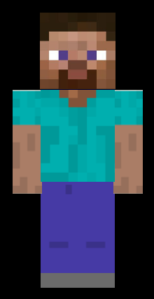

# Minecraft

This is Steve from Minecraft using OpenGL in C:
(textures/steve2.PNG)

## Getting started

- Download this project;
- [Read this file with installation requeriments](requeriments.txt);
- [Execute the project file](project.cbp).

### Basic interaction commands

- I i => Initialization;
- R r => select transformation ROTATION;
- T t => select transformation TRANSLATION;
- X x => select X axis;
- Y y => select Y axis;
- Z z => select Z axis;
- \+ \- => transformation direction.

Other interaction commands are displayed in execution window.

All comments are written in brazilian Portuguese.

#### This was an assignment for Computer Graphics class by MSc Evandro Luís Viapiana from University of Passo Fundo.
